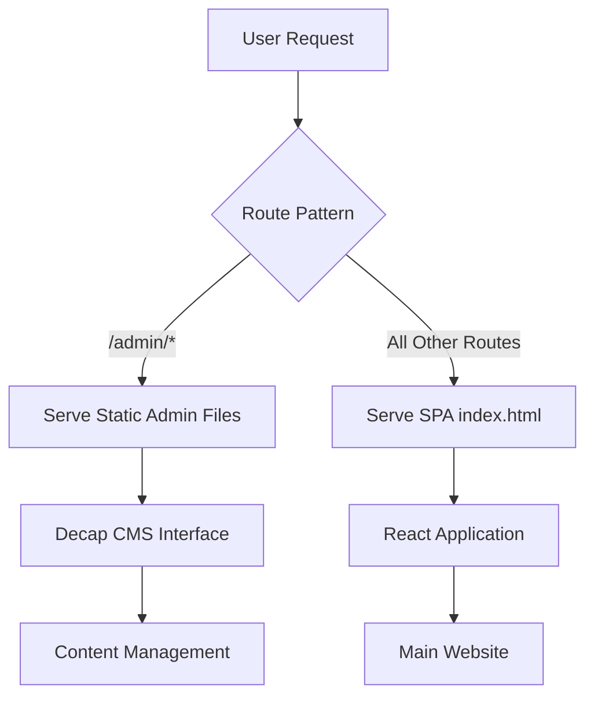

# Design Document

## Overview

This design addresses the admin CMS integration issues by configuring Firebase hosting rules to properly serve the Decap CMS at the /admin route while maintaining SPA routing for the main application. The solution involves updating Firebase hosting configuration, ensuring proper build processes, and validating the deployment.

## Architecture

The application uses a hybrid routing approach:
- **Main Application**: React SPA with client-side routing served from `/dist`
- **Admin Interface**: Static Decap CMS served from `/public/admin`
- **Firebase Hosting**: Configured to handle both routing patterns



## Components and Interfaces

### Firebase Hosting Configuration
- **Purpose**: Route requests appropriately between admin and main app
- **Location**: `firebase.json`
- **Key Changes**: Add specific rewrite rules for admin routes

### Admin Link Component
- **Current State**: Footer component with admin link
- **Issue**: May not be properly configured for the hosting setup
- **Solution**: Ensure link targets the correct admin route

### Build Process
- **Lint**: ESLint validation
- **Build**: Vite production build to `dist/`
- **Deploy**: Firebase hosting deployment

## Data Models

### Firebase Hosting Configuration
```typescript
interface FirebaseHostingConfig {
  public: string;           // "dist"
  ignore: string[];         // Files to ignore
  rewrites: RewriteRule[];  // URL rewrite rules
}

interface RewriteRule {
  source: string;      // URL pattern to match
  destination: string; // Target file/route
}
```

## Correctness Properties

*A property is a characteristic or behavior that should hold true across all valid executions of a system-essentially, a formal statement about what the system should do. Properties serve as the bridge between human-readable specifications and machine-verifiable correctness guarantees.*

<function_calls>
<invoke name="prework">
<parameter name="featureName">admin-cms-fix

### Property Reflection

After reviewing the prework analysis, I identified the following properties and examples:

**Properties (universal rules):**
- 2.1: Admin path routing behavior
- 2.2: Non-admin path routing behavior  
- 2.4: Static asset serving behavior

**Examples (specific test cases):**
- 1.1, 1.2, 1.3, 1.4: Admin interface loading scenarios
- 2.3: Deployment integration test
- 3.1, 3.2, 3.3, 3.4: Build and deployment process tests

**Consolidation:**
- Properties 2.1 and 2.2 can be combined into a single comprehensive routing property
- Examples can be grouped by functional area (admin loading, build process)

### Correctness Properties

Property 1: Firebase hosting routes requests correctly
*For any* URL request, Firebase hosting should route /admin/* paths to static admin files and all other paths to the SPA index.html
**Validates: Requirements 2.1, 2.2**

Property 2: Static assets are served with correct headers
*For any* static admin asset (CSS, JS, images), Firebase hosting should serve them with appropriate MIME types and caching headers
**Validates: Requirements 2.4**

## Error Handling

### Admin Route Access Errors
- **404 Errors**: Ensure admin files exist in public/admin directory
- **MIME Type Errors**: Configure Firebase to serve CSS/JS with correct content types
- **CORS Errors**: Ensure proper headers for CMS API calls

### Build Process Errors
- **Lint Failures**: Address ESLint errors before deployment
- **Build Failures**: Resolve TypeScript/Vite compilation issues
- **Deployment Failures**: Validate Firebase project configuration

### CMS Loading Errors
- **Configuration Errors**: Validate config.yml syntax and paths
- **Authentication Errors**: Ensure GitHub backend configuration is correct
- **Asset Loading Errors**: Verify CDN resources are accessible

## Testing Strategy

### Unit Tests
- Test admin link component renders correctly
- Test Firebase configuration parsing
- Test build script execution

### Integration Tests
- Test admin route accessibility after deployment
- Test CMS interface loading with all collections
- Test main app routing continues to work
- Test static asset serving with correct headers

### Manual Testing
- Click admin link from footer
- Access /admin directly via URL
- Verify CMS loads all configured collections
- Test content editing functionality
- Verify main app routing still works

### Property-Based Testing
Property tests will use a testing framework to validate:
- Route handling across different URL patterns
- Asset serving behavior across different file types
- Each test will run minimum 100 iterations
- Tests will be tagged with: **Feature: admin-cms-fix, Property {number}: {property_text}**

### Build Validation
- Run `npm run lint` to validate code quality
- Run `npm run build` to generate production assets
- Deploy to Firebase and validate both routes work
- Test CMS functionality in production environment